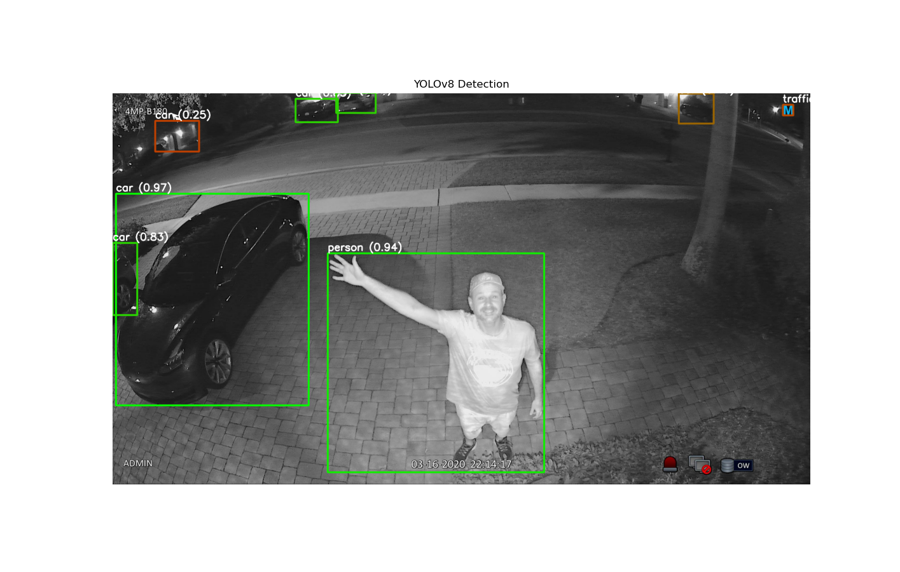

# YOLO Deployment Project

## Опис (Overview)

Проєкт демонструє розгортання моделі YOLOv8 для виявлення об’єктів через FastAPI.
API приймає зображення або посилання на нього, повертає результати з детекцією та візуалізацією.

## Встановлення (Installation)

```bash
git clone https://github.com/твій_логін/yolo-api-deploy.git
cd yolo-api-deploy
pip install -r requirements.txt
```

---
## Запуск
```bash
uvicorn main:app --reload
```
---
Відкрий у браузері:

```arduino
http://127.0.0.1:8000/docs
```
## Інтерфейс API
| Endpoint   | Метод | Вхідні дані             | Вихідні дані                 | Опис                                  |
| ---------- | ----- | ----------------------- | ---------------------------- | ------------------------------------- |
| `/predict` | POST  | Файл зображення або URL | JSON з результатами детекції | Обробка зображення, повертає детекції |

## Приклад використання (curl):
```bash
curl -X POST "http://127.0.0.1:8000/predict" -F "file=@path/to/image.jpg"
```
## Структура проєкту
```css
yolo-api-deploy/
├── main.py # --> основний файл
├── requirements.txt # --> залежності
├── README.md # --> опис проєкту
└── examples/ # --> приклади результатів
    └── example.jpg
```
## Приклад зображення


###  Логи запуску
![Logs] (examples/deploy_logs.png)
