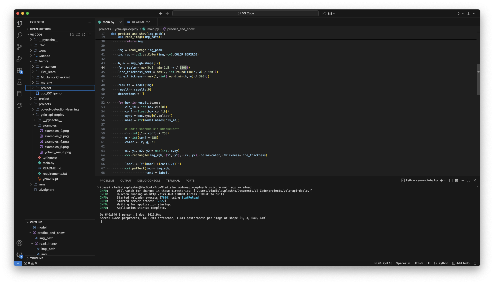

# YOLO Deployment Project

## Опис (Overview)

# Огляд проекту

Проєкт демонструє розгортання моделі YOLOv8 для виявлення об’єктів через FastAPI.
API приймає на вхід зображення або URL, виконує детекцію об’єктів і повертає:

- Результати у JSON з інформацією про кожен об’єкт (клас, впевненість, координати bounding boxes).
- Візуалізацію з накладеними bounding boxes, колір яких адаптується залежно від рівня впевненості моделі.

Таким чином, кольори bounding boxes та підписи інтуїтивно відображають якість розпізнавання.

## Встановлення (Installation)

```bash
git clone https://github.com/vpleshko-lab/yolo-api-deploy.git
cd yolo-api-deploy
pip install -r requirements.txt
```

---
## Запуск
```bash
uvicorn main:app --reload
```
---
Відкрий у браузері:

```arduino
http://127.0.0.1:8000/docs
```
## Інтерфейс API
| Endpoint   | Метод | Вхідні дані             | Вихідні дані                 | Опис                                  |
| ---------- | ----- | ----------------------- | ---------------------------- | ------------------------------------- |
| `/predict` | POST  | Файл зображення або URL | JSON з результатами детекції | Обробка зображення, повертає детекції |

## Приклад використання (curl):
```bash
curl -X POST "http://127.0.0.1:8000/predict" -F "file=@path/to/image.jpg"
```
## Структура проєкту
```css
yolo-api-deploy/
├── app/               # Код застосунку (main.py, predict.py тощо)
├── Dockerfile         # Інструкції для збірки Docker образу
├── requirements.txt   # Python-залежності
├── .dockerignore      # Файли, які не копіюємо у образ
├── examples/          # Приклади вхідних/вихідних даних
├── README.md          # Цей файл
└── screenshots/       # Фото результатів та знімки екрана з демонстрацією роботи

```
## Приклад зображення


###  Логи запуску

