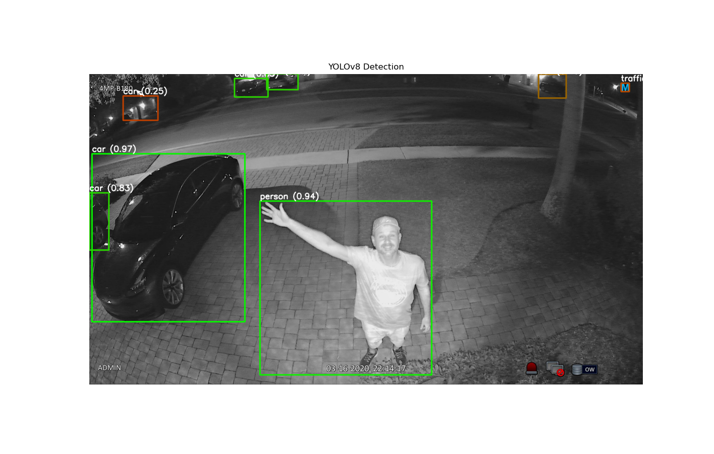
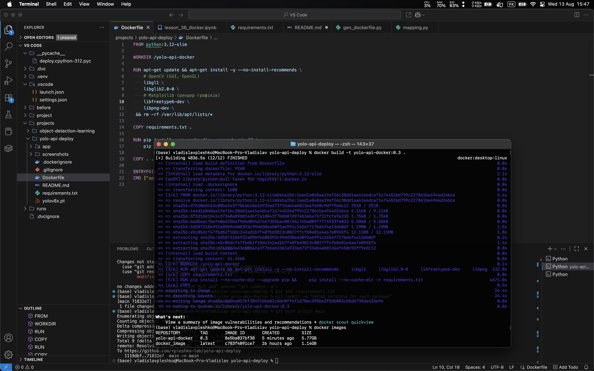
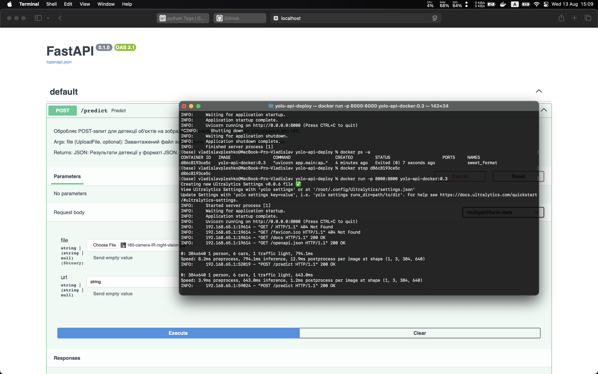
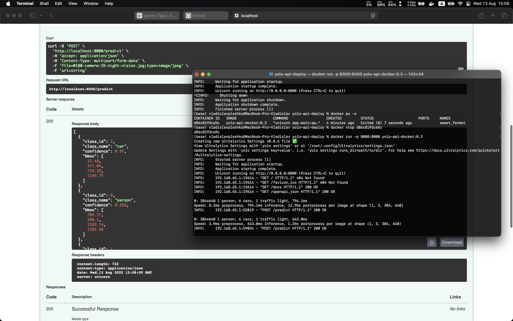

# YOLO Deployment Project

## Зміст
- [Огляд проєкту та його опис](#огляд-проєкту)
- [Структура проєкту](#структура-проєкту)
- [Інтерфейс API](#інтерфейс-api)
- [Клонування репозиторію](#клонування-репозиторію)
- [Запуск (локально)](#запуск-локально)
- [Приклад використання curl](#приклад-використання-curl)
- [Створення образу Docker](#створення-образу-docker)
- [Запуск контейнера](#як-запускати-docker-контейнер)
- [Приклад зображення (локально)](#приклад-зображення-результат-детекції)
- [Логи запусків](#логи-запусків)

## Огляд проєкту

Проєкт демонструє розгортання моделі YOLOv8 для виявлення об’єктів через FastAPI.
API приймає на вхід зображення або URL, виконує детекцію об’єктів і повертає:

- Результати у JSON з інформацією про кожен об’єкт (клас, впевненість, координати bounding boxes).
- Візуалізацію з накладеними bounding boxes, колір яких адаптується залежно від рівня впевненості моделі (при локальному запуску).

Таким чином, кольори bounding boxes та підписи інтуїтивно відображають якість розпізнавання.

## Структура проєкту
```css
yolo-api-deploy/
├── app/               # Код застосунку (main.py, predict.py тощо)
├── Dockerfile         # Інструкції для збірки Docker образу
├── requirements.txt   # Python-залежності
├── .dockerignore      # Файли, які ігноруються при побудові образу
├── README.md          # Цей файл
└── screenshots/       # Фото результатів та знімки екрана з демонстрацією роботи
```

## Інтерфейс API
| Endpoint   | Метод | Вхідні дані             | Вихідні дані                 | Опис                                  |
| ---------- | ----- | ----------------------- | ---------------------------- | ------------------------------------- |
| `/predict` | POST  | Файл зображення або URL | JSON з результатами детекції | Обробка зображення, повертає детекції |


## Клонування репозиторію

```bash
git clone https://github.com/vpleshko-lab/yolo-api-deploy.git
cd yolo-api-deploy
pip install -r requirements.txt
```
---
## Запуск (локально)
```bash
uvicorn main:app --reload
```
Відкрий у браузері:

```plaintext
http://127.0.0.1:8000/docs
```

### Приклад використання (curl):
```bash
curl -X POST "http://127.0.0.1:8000/predict" -F "file=@path/to/image.jpg"
```
---
## Створення образу Docker
Знаходячись у корені проєкту виконай у терміналі:
```bash
docker build -t my_image_name .
```
### Як запускати Docker контейнер

```bash
docker run -p 8000:8000 yolo-api-docker:0.3
```

Далі перейди у браузері:
```plaintext
http://localhost:8000/docs
```
---

## Приклад зображення (результат детекції)


###  Логи запусків

#### Побудова образу Docker

#### Запуски контейнеру


